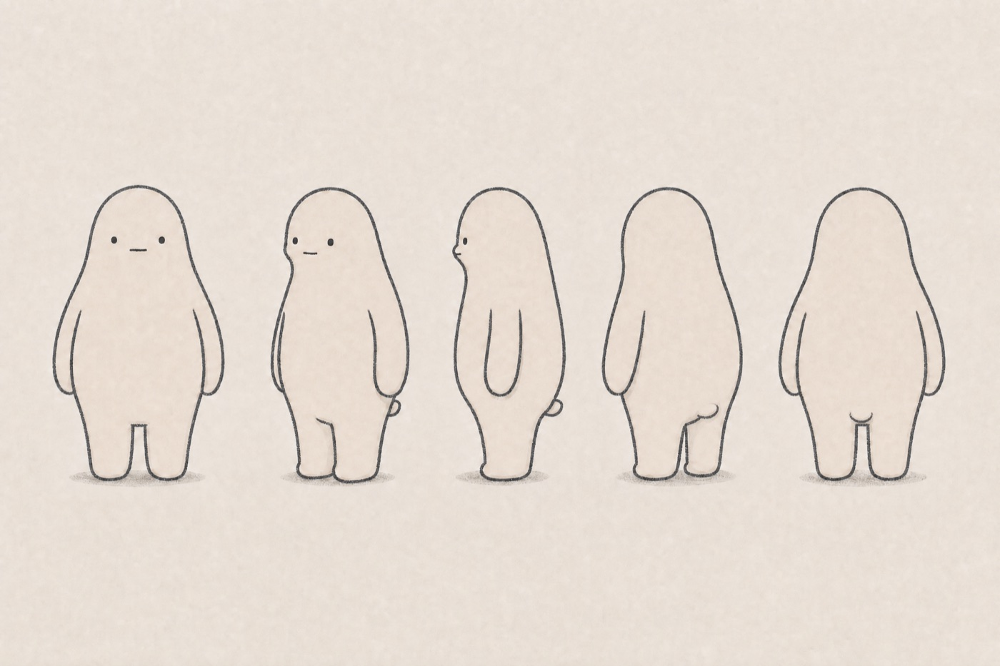
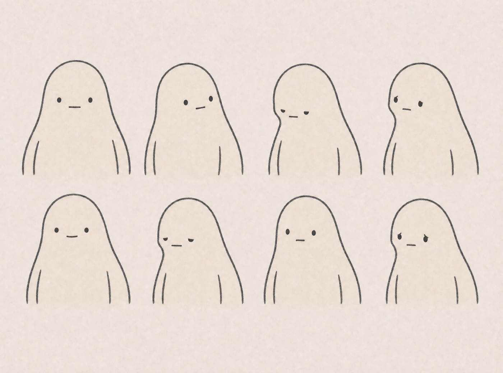
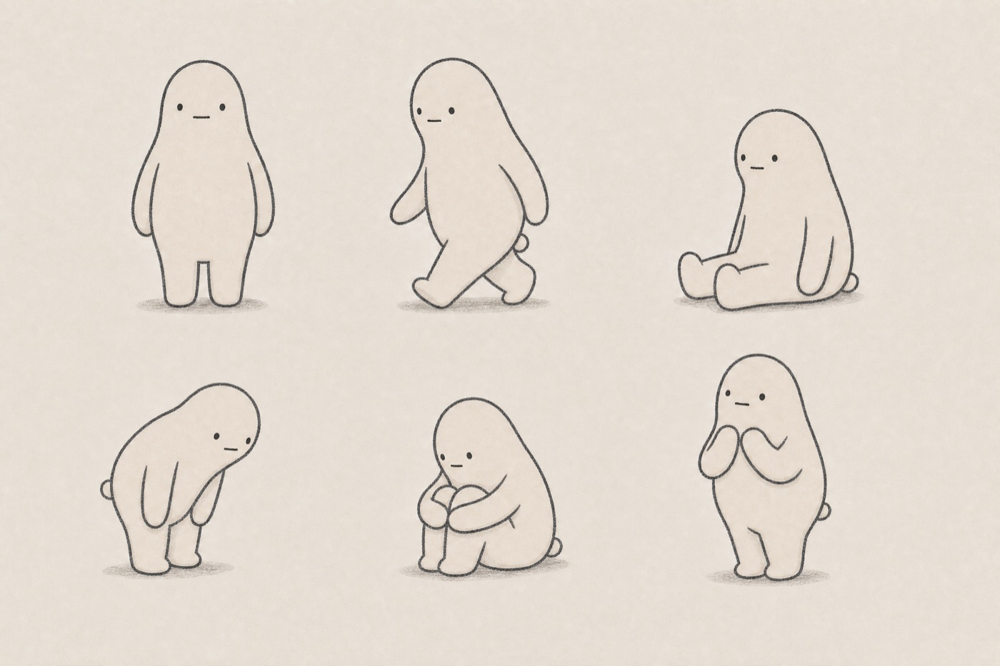

# Fig identity notes

Fig is the quiet mascot for Figment: a small figment of imagination that humanises the creative studio without becoming a chatty assistant character.

## Character rules

- One soft, continuous, slightly asymmetric body; nothing sharp or anatomical.
- Long relaxed arms, short grounded legs, and a small flattened tail nub integrated into the lower-back contour.
- Two dark oval eyes and one tiny closed mouth. No eyebrows, nose, ears, hair, or decorative facial marks.
- Warm off-white paper texture with a charcoal-grey hand-drawn line.
- Calm, observant personality. Feeling comes mainly from gaze, head angle, compression, posture, and hand placement.
- Never force cuteness with exaggerated smiles, blush, giant eyes, or frantic gestures.

## Production sheets

### Neutral turnaround

Five consistent standing angles establish the body, limbs, profile, and attached tail nub.

### Quiet expressions

The facial range stays restrained: neutral, curious, focused, concerned, pleased, tired, surprised, and tender can all be expressed without adding a speaking persona.

### Posture and behaviour

Standing, walking, sitting, inspecting, thinking, and contained delight form the initial physical vocabulary for interface moments, animation, and merchandise studies.

## Interface assets

- `apps/studio/public/fig-avatar.png` — default compact portrait
- `apps/studio/public/fig-avatar-hover.png` — subtle hover/focus expression
- `apps/studio/public/favicon.png` — 64-pixel browser icon
- `apps/studio/public/apple-touch-icon.png` — 180-pixel touch icon

These are curated release assets. The full internal development project—including its prompts, Krea responses, lineage, and rejected generations—is intentionally not distributed with the clonable starter.
